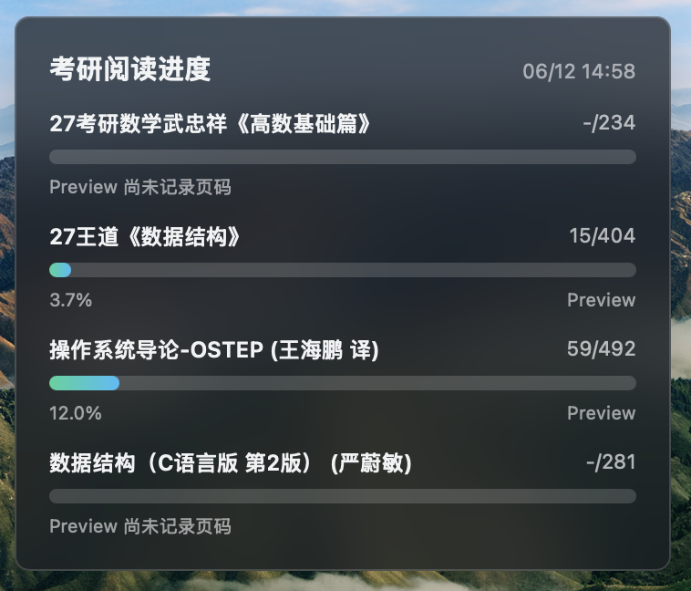

# preview-pg

定时将macOS Preview（预览）软件的PDF阅读进度导出为JSON。当然，可以给定文件夹，让它只导出这个文件夹里的PDF的进度。

附加一个[Übersicht](https://github.com/felixhageloh/uebersicht)小组件为演示用例。

**由Codex完成**，赞美Codex。

## 文件说明

- `Sources/study_progress.swift`：读取PDF页数，计算Preview软件视图状态，然后写入`progress.json`。
- `scripts/run-study-progress.sh`: launchd 入口点。
- `launchd/com.xianliticn.study-progress.plist`: LaunchAgent配置为每30分钟执行一次。
- `tools/inspect_preview_viewstate.swift`: small debugging helper for Preview's
  view state plist.

- `widgets/study-progress.jsx`：Übersicht插件，用来显示阅读进度条。效果大致如下：~~唉考研党~~   


## 构建

```sh
mkdir -p .build/swift-module-cache
swiftc -module-cache-path .build/swift-module-cache \
  Sources/study_progress.swift \
  -o .build/study-progress-refresh
```

## 手动安装

```sh
APP_DIR="$HOME/Library/Application Support/UbersichtStudyProgress"
WIDGET_DIR="$HOME/Library/Application Support/Übersicht/widgets"

mkdir -p "$APP_DIR" "$WIDGET_DIR" "$HOME/Library/LaunchAgents"
cp .build/study-progress-refresh "$APP_DIR/study-progress-refresh"
cp scripts/run-study-progress.sh "$APP_DIR/run-daily.sh"
cp widgets/study-progress.jsx "$WIDGET_DIR/study-progress.jsx"
cp launchd/com.xianliticn.study-progress.plist "$HOME/Library/LaunchAgents/"
chmod 755 "$APP_DIR/study-progress-refresh" "$APP_DIR/run-daily.sh"
launchctl unload "$HOME/Library/LaunchAgents/com.xianliticn.study-progress.plist" 2>/dev/null || true
launchctl load "$HOME/Library/LaunchAgents/com.xianliticn.study-progress.plist"
```

默认扫描PDF的文件夹是：

```text
~/Desktop/考研/基础期
```
至于为什么是这个，参见[缘起](#缘起)。

默认输出文件是：

```text
~/Library/Application Support/UbersichtStudyProgress/progress.json
```

## 缘起

在下考研的时候需要看很多书，而且很多时候喜欢多线推进。但是这样一来不太好跟踪自己的进度（因为要打开Preview软件才能看到当前页码），所以我就让Codex帮我搞了这么一个小软件。提示词：

> 设置一个自动化，我给你描述一下我的需求：
> 
> 在我的桌面有一个文件夹“考研/基础期”，里面有几本书，都是我考研要学的。我的电脑上已经安装了Ubersicht，可以在桌面显示小组件。现在我需要：
> 
> 1. 每天有且仅有一次执行，打开这些书，看看在“预览”APP里页码是多少，也就是看看阅读进度
> 2. 编写一个Ubersicht小组件，显示在桌面，呈现为一些进度条，按照不同的书分别呈现阅读进度
> 3. 整个过程要无感知，也就是说最好能在后台进行，不影响我工作
> ---
> 我觉得改成30分钟采集一次比较好

事就这样成了。

该项目纯属自用，如果大家感兴趣，请尽情享用。凡是大家提出的批评我都要接受，凡是大家提出的PR我都要合并。